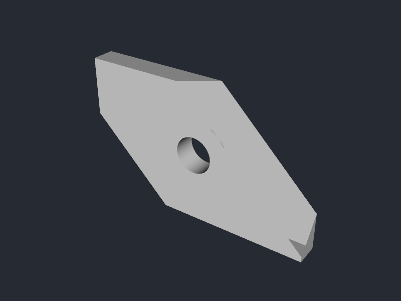
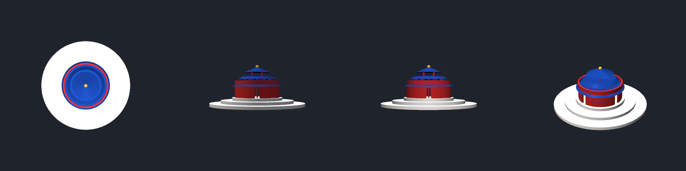
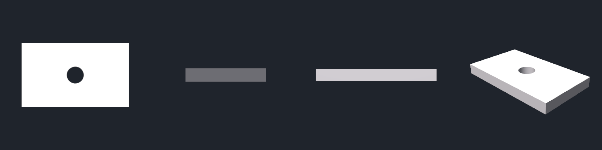

# FreeCAD Skill for Antigravity CLI 🛠️

The first native **Antigravity CLI skill** for automated 3D modeling, CAD engineering, and differentiable physical optimization. This skill transforms the Antigravity CLI agent into an autonomous CAD engineer capable of designing, simulating, and optimizing 3D structures through the FreeCAD Python API.


## 🌟 Key Features

- **Autonomous 3D Modeling:** Ask the agent to design complex parts (brackets, flanges, gears) using natural language.
- **Differentiable CAD:** Integrated with **JAX-FEM** for automated structural optimization (e.g., finding the optimal radius for a tree trunk based on physical loads).
- **Headless CLI Workflow:** Optimized for terminal environments using `freecadcmd` and headless virtual frames (`Xvfb`).
- **Multi-Format Export:** Seamlessly export to **STEP** (CAD), **STL** (3D Printing), and **GLB** (Web/AR) with automatic Y-up orientation.
- **Direct Python Control:** Allows the agent to write and execute high-fidelity Python scripts for precise geometric control.

## 🚀 Quick Start

### 1. Prerequisites
Ensure you have the following installed on your system:
- **FreeCAD Desktop** (provides the Python libraries)
- **xvfb** (for headless execution)
- **obj2gltf** (for GLB conversion)

```bash
# Linux (Debian/Ubuntu)
sudo apt update && sudo apt install freecad xvfb -y
npm install -g obj2gltf
```

### 2. Installation
Install the skill directly into your Antigravity CLI environment by copying or symlinking the `freecad` directory to your global skills path:

```bash
# Clone the repository
git clone https://github.com/1kaiser/freecad-skill.git
cd freecad-skill

# Copy to Antigravity CLI skills directory
mkdir -p ~/.gemini/skills/freecad
cp -r freecad/* ~/.gemini/skills/freecad/
```

### 3. Usage
Once installed, reload your skills (`/skills reload`) and command the agent:

```text
"Design a 3D tree with a 50mm trunk and export it as a GLB."
"Optimize the thickness of a support bracket to handle a 100N load using JAX-FEM."
"Create a STEP file for a custom cooling manifold with integrated fins."
```

## 🧪 Verification and Examples

### 🛠️ Mounting Bracket Example
To verify that the FreeCAD integration works correctly, a mounting bracket was generated procedurally and rendered headlessly:

1. **Geometry Generation (`test_bracket.py`)**: Runs a python script using FreeCAD's native Python API to generate a base plate with a hollow cylinder hole, exporting to `bracket.step` and `bracket.stl`.
2. **Headless Render (`render_stl.py`)**: Spawns a virtual frame buffer `Xvfb` on `:99` with hardware GLX enabled and headlessly renders the generated STL model to a high-quality PNG.

#### Rendered output:


### ⛩️ Temple of Heaven & General Multi-View Plotting Example
To verify multi-part assembly, custom materials, solar path illumination, and general 3D plotting functionality:
1. **Geometry Generation (`create_temple.py`)**: Models the Hall of Prayer for Good Harvests and its three-tiered marble altar, exporting individual components to separate STL files.
2. **Generalized Multi-View Plotter (`render_multi_view.py`)**: A fully parameterizable CLI utility that can render multi-view orthographic and isometric previews for **any** 3D model (supporting `.stl`, `.obj`, `.step`, `.stp`, `.iges`, `.igs`, `.brep`, `.fcstd` file formats) with customizable materials, colors, background colors, camera distance, zoom, views, and solar angles.

#### Rendered output:


#### CLI Usage Examples:
```bash
# Render default Temple of Heaven model:
/home/kaiser/.conda/envs/freecad_env/bin/python freecad/examples/render_multi_view.py

# Render an arbitrary STL model with custom color, glossy material, custom views, dark background, and headlight:
/home/kaiser/.conda/envs/freecad_env/bin/python freecad/examples/render_multi_view.py \
  -i freecad/examples/bracket.stl \
  -c "#33A8FF" \
  -m glossy \
  -o freecad/examples/bracket_custom.png \
  --views top front isometric \
  --bg-color "#0E1117" \
  --headlight 0.4

# Render a STEP file directly (automatically converted to temporary mesh via FreeCAD):
/home/kaiser/.conda/envs/freecad_env/bin/python freecad/examples/render_multi_view.py \
  -i freecad/examples/bracket.step \
  -o freecad/examples/bracket_step_custom.png \
  -c "#FF9933" \
  -m glossy
```

##### Custom STL Multi-View Render (`bracket_custom.png`):


##### STEP Dynamic Mesh Multi-View Render (`bracket_step_custom.png`):


## 📁 Repository Structure

```text
.
├── freecad/                                  # Native Antigravity CLI Skill Definition
│   ├── SKILL.md                              # Main instruction file and metadata
│   └── examples/                             # Procedural and Differentiable CAD examples
│       ├── test_bracket.py                   # Generates STEP and STL of a mounting bracket
│       ├── render_stl.py                     # Headless VTK script that renders STL to PNG
│       ├── bracket.png                       # Rendered image of the bracket
│       ├── create_temple.py                  # Procedural modeling of the Temple of Heaven
│       ├── render_multi_view.py              # Multi-view rendering with April sun path and materials
│       ├── temple_preview.png                # Combined rendering preview of the Temple
│       ├── FreeCAD_Ollama_Colab.ipynb        # Jupyter Notebook with tree creation inside Colab
│       ├── optimize_tree.py                  # JAX-FEM structural optimization
│       └── create_colored_tree_v2.py         # High-fidelity GLB with vertex colors
└── README.md                                 # Professional documentation
```

## 🧪 Advanced: Differentiable Optimization
This skill is unique in its support for **JAX-based physics-driven design**. By combining FreeCAD's geometry engine with JAX-FEM, the agent can:
1. Initialize a base geometry in FreeCAD.
2. Differentiate through a FEM simulation to find optimal parameters.
3. Update the high-fidelity CAD model with the optimized results.

## 📚 References & Acknowledgments

### Foundational Frameworks
- **[Gemini CLI](https://github.com/google/gemini-cli):** The primary agent interface and skill system provider.
- **[FreeCAD](https://www.freecad.org/):** The open-source parametric 3D modeler powering the geometric engine.
- **[JAX-FEM](https://github.com/deepmodeling/jax-fem):** The differentiable finite element package enabling structural optimization.

### Inspiration & Community
- **[drawio-mcp](https://github.com/1kaiser/drawio-mcp):** Inspired the "Skill + CLI" architectural pattern for seamless tool integration.
- **[freecad-mcp](https://github.com/neka-nat/freecad-mcp):** Provided initial insights into MCP-based CAD control.

### Academic Citations
If you use this workflow in academic research, please consider citing the following foundational works:

**JAX-FEM (Structural Optimization):**
```bibtex
@article{xue2023jax,
  title={JAX-FEM: A differentiable GPU-accelerated 3D finite element solver for automatic inverse design and mechanistic data science},
  author={Xue, Tianju and Liao, Shuheng and Gan, Zhengtao and Park, Chanwook and Xie, Xiaoyu and Liu, Wing Kam and Cao, Jian},
  journal={Computer Physics Communications},
  pages={108802},
  year={2023},
  publisher={Elsevier}
}
```

**FreeCAD (Geometric Modeling):**
```bibtex
@online{freecad2024,
  author = {The FreeCAD Team},
  title = {FreeCAD: An open-source parametric 3D modeler},
  year = {2024},
  url = {https://www.freecad.org}
}
```

## 📜 License
This project is licensed under the MIT License - see the [LICENSE](LICENSE) file for details.

---
Created and maintained by [1kaiser](https://github.com/1kaiser)
